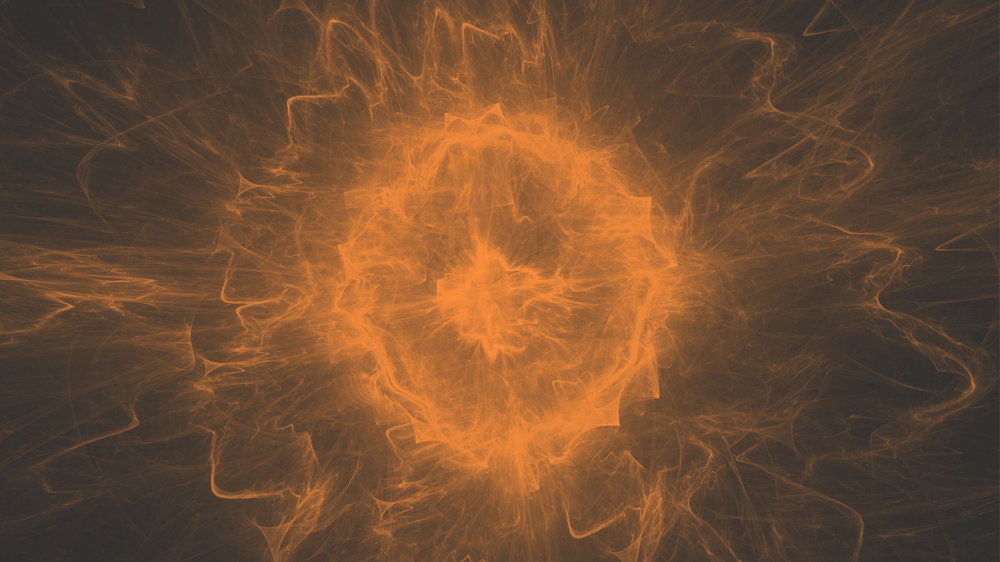
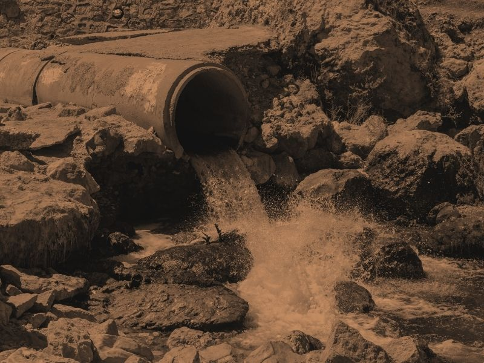
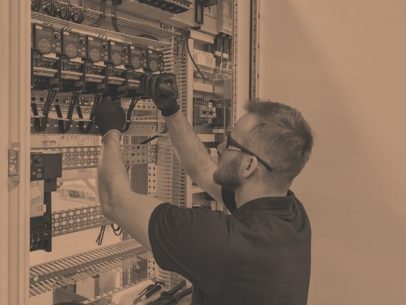
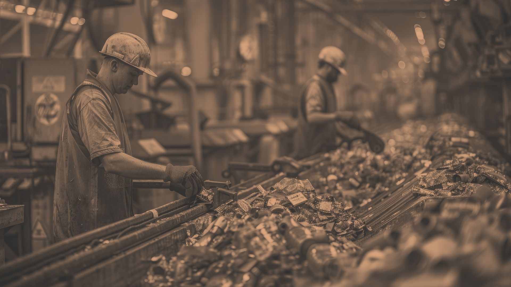

# VRPL Website - Complete Implementation Specification

**Project:** Varanasi Recyclers Private Limited (VRPL) Corporate Website
**Domain:** Waste-to-Energy, Plasma Gasification, Circular Economy, Green Hydrogen
**Design Inspiration:** https://www.redwoodmaterials.com/ (Redwood Materials)
**Deployment Target:** Coolify (VPS with Docker)

---

## Table of Contents

1. [Project Overview](#project-overview)
2. [Technology Stack](#technology-stack)
3. [Design System - Bio-Industrial Fusion](#design-system)
4. [Project Structure](#project-structure)
5. [Navigation System](#navigation-system)
6. [Page Specifications](#page-specifications)
7. [Component Library](#component-library)
8. [JavaScript Functionality](#javascript-functionality)
9. [Responsive Design](#responsive-design)
10. [Deployment Configuration](#deployment-configuration)
11. [Content Mapping](#content-mapping)
12. [Image Asset Requirements](#image-asset-requirements)

---

## Project Overview

### Company Information
- **Name:** Varanasi Recyclers Private Limited (VRPL)
- **Status:** Government-recognized Startup (DPIIT certified)
- **Vision:** Transform city waste into electricity → then green hydrogen
- **Technology:** Plasma gasification with indigenous tech (CSIR-CMERI & BARC)
- **Email:** vrplvns@gmail.com

### Mission Alignment
- Samriddh Uttar Pradesh 2047
- Nari Shakti Mission 2047 (50% women workforce)
- Viksit Bharat 2047 initiative
- Sustainable Development Goals (SDG-3, SDG-6)

### Target Audience
Government officers, investors, researchers, public, educational institutions

---

## Technology Stack

### Frontend
- **HTML5** - Semantic markup, accessibility-first
- **CSS3** - Modern features (Grid, Flexbox, Custom Properties, Animations)
- **Vanilla JavaScript** - ES6+, no frameworks (lightweight, portable)
- **No build tools** - Direct deployment, easy maintenance

### Deployment
- **Docker** - Containerized deployment
- **Nginx** - Static file serving, optimized configuration
- **Coolify** - VPS deployment platform

### Performance Goals
- First Contentful Paint: < 1.5s
- Time to Interactive: < 3s
- Lighthouse Score: 90+
- Mobile-friendly: 100%

---

## Design System - Bio-Industrial Fusion

### Color Palette

#### Copper Series
```css
--copper-dark: #6A3E2C;
--copper-medium: #9C6A4A;
--copper-light: #C89F80;
```

#### Eco-Green Series
```css
--forest-green: #1C3B2C;
--moss-green: #496D53;
--light-green: #A7C8A1;
```

#### Metallic Grays
```css
--steel-gray: #2E2E2E;
--charcoal: #1C1C1C;
--industrial-silver: #C7C7C7;
--aluminum: #DCD7D0;
```

#### Functional Colors
```css
--background-dark: #1C1C1C;
--background-medium: #2E2E2E;
--text-primary: #FFFFFF;
--text-secondary: #DCD7D0;
--text-accent: #C89F80;
```

### Typography

#### Font Stack
```css
--font-primary: 'Inter', 'Helvetica Neue', -apple-system, BlinkMacSystemFont, sans-serif;
--font-display: 'Space Grotesk', 'Inter', sans-serif;
```

#### Type Scale
```css
--text-xs: clamp(12px, 1vw, 14px);
--text-sm: clamp(14px, 1.2vw, 16px);
--text-base: clamp(16px, 1.5vw, 18px);
--text-lg: clamp(18px, 2vw, 22px);
--text-xl: clamp(22px, 2.5vw, 28px);
--text-2xl: clamp(28px, 3vw, 36px);
--text-3xl: clamp(36px, 4vw, 48px);
--text-4xl: clamp(48px, 6vw, 72px);
```

#### Font Weights
```css
--weight-normal: 400;
--weight-medium: 500;
--weight-semibold: 600;
--weight-bold: 700;
```

### Spacing System
```css
--space-xs: 8px;
--space-sm: 16px;
--space-md: 24px;
--space-lg: 32px;
--space-xl: 48px;
--space-2xl: 64px;
--space-3xl: 96px;
--space-4xl: 120px;
```

### Border Radius
```css
--radius-sm: 4px;
--radius-md: 8px;
--radius-lg: 12px;
--radius-xl: 16px;
--radius-full: 9999px;
```

### Shadows
```css
--shadow-sm: 0 2px 8px rgba(0, 0, 0, 0.1);
--shadow-md: 0 4px 12px rgba(0, 0, 0, 0.15);
--shadow-lg: 0 8px 24px rgba(0, 0, 0, 0.2);
--shadow-glow-copper: 0 0 24px rgba(156, 106, 74, 0.4);
--shadow-glow-green: 0 0 24px rgba(73, 109, 83, 0.6);
```

### Transitions
```css
--transition-fast: 150ms ease;
--transition-base: 300ms ease;
--transition-slow: 500ms ease;
--transition-bounce: 400ms cubic-bezier(0.68, -0.55, 0.265, 1.55);
```

---

## Project Structure

```
vrpl/
├── index.html
├── about.html
├── technology.html
├── phases.html
├── impact.html
├── government.html
├── training.html
├── contact.html
├── css/
│   ├── reset.css
│   ├── variables.css
│   ├── global.css
│   ├── components.css
│   ├── navigation.css
│   ├── sections.css
│   └── responsive.css
├── js/
│   ├── main.js
│   ├── navigation.js
│   ├── overlay-menu.js
│   ├── scroll-observer.js
│   ├── animations.js
│   └── utils.js
├── assets/
│   ├── images/
│   │   ├── hero/
│   │   ├── technology/
│   │   ├── team/
│   │   ├── process/
│   │   └── overlay/
│   ├── icons/
│   └── textures/
├── Dockerfile
├── nginx.conf
├── docker-compose.yml
├── .dockerignore
└── README.md
```

---

## Navigation System

### Header Structure (Redwood-Inspired)

The navigation follows the Redwood Materials pattern with these key features:

1. **Fixed Header** - Stays at top, becomes visible after scrolling past hero
2. **Breadcrumb Navigation** - Shows current section context
3. **Hamburger Menu** - Opens full-screen overlay menu
4. **Smooth Scroll** - Animated transitions between sections
5. **Active State** - Updates based on scroll position via Intersection Observer

### HTML Structure
```html
<header class="main-header" id="mainHeader">
  <div class="header-container">
    <!-- Logo -->
    <div class="header-logo">
      <a href="index.html">
        
      </a>
    </div>

    <!-- Breadcrumb Navigation -->
    <nav class="breadcrumb-nav" aria-label="Breadcrumb">
      <a href="#home" class="breadcrumb-link active">Home</a>
      <span class="breadcrumb-separator">/</span>
      <a href="#technology" class="breadcrumb-link">Technology</a>
      <span class="breadcrumb-separator">/</span>
      <a href="#impact" class="breadcrumb-link">Impact</a>
    </nav>

    <!-- Hamburger Menu Trigger -->
    <button class="menu-trigger" id="menuTrigger" aria-label="Open menu" aria-expanded="false">
      <span class="hamburger-line"></span>
      <span class="hamburger-line"></span>
      <span class="hamburger-line"></span>
    </button>
  </div>
</header>
```

### Full-Screen Overlay Menu

```html
<div class="overlay-menu" id="overlayMenu" aria-hidden="true">
  <!-- Background Image Container (changes on hover) -->
  <div class="overlay-background" id="overlayBackground"></div>

  <!-- Overlay Content -->
  <div class="overlay-content">
    <!-- Close Button -->
    <button class="overlay-close" id="overlayClose" aria-label="Close menu">
      <span class="close-icon">×</span>
    </button>

    <!-- Menu Links -->
    <nav class="overlay-nav">
      <ul class="overlay-menu-list">
        <li class="overlay-menu-item" data-image="assets/images/overlay/home.jpg">
          <a href="index.html" class="overlay-link">
            <span class="link-number">01</span>
            <span class="link-text">Home</span>
          </a>
        </li>
        <li class="overlay-menu-item" data-image="assets/images/overlay/about.jpg">
          <a href="about.html" class="overlay-link">
            <span class="link-number">02</span>
            <span class="link-text">About Us</span>
          </a>
        </li>
        <li class="overlay-menu-item" data-image="assets/images/overlay/technology.jpg">
          <a href="technology.html" class="overlay-link">
            <span class="link-number">03</span>
            <span class="link-text">Technology</span>
          </a>
        </li>
        <li class="overlay-menu-item" data-image="assets/images/overlay/phases.jpg">
          <a href="phases.html" class="overlay-link">
            <span class="link-number">04</span>
            <span class="link-text">Project Phases</span>
          </a>
        </li>
        <li class="overlay-menu-item" data-image="assets/images/overlay/impact.jpg">
          <a href="impact.html" class="overlay-link">
            <span class="link-number">05</span>
            <span class="link-text">Environmental Impact</span>
          </a>
        </li>
        <li class="overlay-menu-item" data-image="assets/images/overlay/government.jpg">
          <a href="government.html" class="overlay-link">
            <span class="link-number">06</span>
            <span class="link-text">Government Alignment</span>
          </a>
        </li>
        <li class="overlay-menu-item" data-image="assets/images/overlay/training.jpg">
          <a href="training.html" class="overlay-link">
            <span class="link-number">07</span>
            <span class="link-text">Training & Awareness</span>
          </a>
        </li>
        <li class="overlay-menu-item" data-image="assets/images/overlay/contact.jpg">
          <a href="contact.html" class="overlay-link">
            <span class="link-number">08</span>
            <span class="link-text">Contact</span>
          </a>
        </li>
      </ul>
    </nav>

    <!-- Contact Info in Overlay -->
    <div class="overlay-footer">
      <a href="mailto:vrplvns@gmail.com" class="overlay-contact">vrplvns@gmail.com</a>
    </div>
  </div>
</div>
```

### CSS for Navigation

```css
/* Main Header */
.main-header {
  position: fixed;
  top: 0;
  left: 0;
  width: 100%;
  z-index: 100;
  background: rgba(46, 46, 46, 0.95);
  backdrop-filter: blur(10px);
  border-bottom: 1px solid rgba(156, 106, 74, 0.3);
  transform: translateY(-100%);
  transition: transform var(--transition-base);
}

.main-header.visible {
  transform: translateY(0);
}

.header-container {
  max-width: 1600px;
  margin: 0 auto;
  padding: var(--space-md) var(--space-xl);
  display: flex;
  justify-content: space-between;
  align-items: center;
}

/* Breadcrumb Navigation */
.breadcrumb-nav {
  display: flex;
  align-items: center;
  gap: var(--space-sm);
}

.breadcrumb-link {
  color: var(--text-secondary);
  text-decoration: none;
  font-size: var(--text-sm);
  font-weight: var(--weight-medium);
  transition: color var(--transition-fast);
  position: relative;
}

.breadcrumb-link:hover,
.breadcrumb-link.active {
  color: var(--copper-light);
}

.breadcrumb-link.active::after {
  content: '';
  position: absolute;
  bottom: -4px;
  left: 0;
  width: 100%;
  height: 2px;
  background: linear-gradient(90deg, var(--copper-medium), var(--light-green));
}

.breadcrumb-separator {
  color: var(--industrial-silver);
  font-size: var(--text-sm);
}

/* Hamburger Menu */
.menu-trigger {
  background: transparent;
  border: none;
  cursor: pointer;
  padding: var(--space-sm);
  display: flex;
  flex-direction: column;
  gap: 6px;
  z-index: 101;
}

.hamburger-line {
  width: 28px;
  height: 2px;
  background: var(--copper-medium);
  transition: all var(--transition-base);
}

.menu-trigger:hover .hamburger-line {
  background: var(--copper-light);
  box-shadow: var(--shadow-glow-copper);
}

.menu-trigger.active .hamburger-line:nth-child(1) {
  transform: rotate(45deg) translateY(8px);
}

.menu-trigger.active .hamburger-line:nth-child(2) {
  opacity: 0;
}

.menu-trigger.active .hamburger-line:nth-child(3) {
  transform: rotate(-45deg) translateY(-8px);
}

/* Overlay Menu */
.overlay-menu {
  position: fixed;
  top: 0;
  left: 0;
  width: 100%;
  height: 100%;
  z-index: 1000;
  visibility: hidden;
  opacity: 0;
  transition: opacity var(--transition-base), visibility var(--transition-base);
}

.overlay-menu.active {
  visibility: visible;
  opacity: 1;
}

.overlay-background {
  position: absolute;
  top: 0;
  left: 0;
  width: 100%;
  height: 100%;
  background-size: cover;
  background-position: center;
  background-repeat: no-repeat;
  transition: opacity var(--transition-base);
}

.overlay-background::before {
  content: '';
  position: absolute;
  top: 0;
  left: 0;
  width: 100%;
  height: 100%;
  background: linear-gradient(135deg, rgba(28, 59, 44, 0.85), rgba(46, 46, 46, 0.9));
}

.overlay-content {
  position: relative;
  z-index: 2;
  width: 100%;
  height: 100%;
  display: flex;
  flex-direction: column;
  justify-content: center;
  padding: var(--space-4xl) var(--space-2xl);
}

.overlay-close {
  position: absolute;
  top: var(--space-xl);
  right: var(--space-xl);
  background: transparent;
  border: 2px solid var(--copper-medium);
  width: 60px;
  height: 60px;
  border-radius: 50%;
  cursor: pointer;
  transition: all var(--transition-base);
  display: flex;
  align-items: center;
  justify-content: center;
}

.close-icon {
  font-size: 32px;
  color: var(--copper-light);
  line-height: 1;
}

.overlay-close:hover {
  background: var(--copper-medium);
  box-shadow: var(--shadow-glow-green);
  transform: rotate(90deg);
}

.overlay-menu-list {
  list-style: none;
  padding: 0;
  margin: 0;
}

.overlay-menu-item {
  margin-bottom: var(--space-lg);
  transform: translateX(-50px);
  opacity: 0;
  transition: all var(--transition-base);
}

.overlay-menu.active .overlay-menu-item {
  transform: translateX(0);
  opacity: 1;
}

/* Stagger animation */
.overlay-menu.active .overlay-menu-item:nth-child(1) { transition-delay: 0.1s; }
.overlay-menu.active .overlay-menu-item:nth-child(2) { transition-delay: 0.15s; }
.overlay-menu.active .overlay-menu-item:nth-child(3) { transition-delay: 0.2s; }
.overlay-menu.active .overlay-menu-item:nth-child(4) { transition-delay: 0.25s; }
.overlay-menu.active .overlay-menu-item:nth-child(5) { transition-delay: 0.3s; }
.overlay-menu.active .overlay-menu-item:nth-child(6) { transition-delay: 0.35s; }
.overlay-menu.active .overlay-menu-item:nth-child(7) { transition-delay: 0.4s; }
.overlay-menu.active .overlay-menu-item:nth-child(8) { transition-delay: 0.45s; }

.overlay-link {
  text-decoration: none;
  display: flex;
  align-items: baseline;
  gap: var(--space-lg);
  font-size: var(--text-4xl);
  font-weight: var(--weight-bold);
  color: var(--text-primary);
  transition: all var(--transition-base);
  position: relative;
}

.link-number {
  font-size: var(--text-lg);
  color: var(--copper-medium);
  font-weight: var(--weight-medium);
}

.overlay-link:hover {
  color: var(--copper-light);
  text-shadow: 0 0 20px rgba(167, 200, 161, 0.5);
  transform: translateX(20px);
}

.overlay-link:hover .link-number {
  color: var(--light-green);
}

.overlay-footer {
  position: absolute;
  bottom: var(--space-xl);
  left: var(--space-2xl);
}

.overlay-contact {
  color: var(--text-secondary);
  text-decoration: none;
  font-size: var(--text-lg);
  transition: color var(--transition-fast);
}

.overlay-contact:hover {
  color: var(--copper-light);
}
```

---

## Page Specifications

### 1. HOME PAGE (index.html)

#### Hero Section
```html
<section class="hero-section" id="home">
  <!-- Hero Background Image -->
  <div class="hero-background">
    
    <div class="hero-overlay"></div>

    <!-- Copper Diagonal Streak -->
    <div class="copper-streak"></div>

    <!-- Animated Particles (Optional) -->
    <div class="particle-container" id="particleContainer"></div>
  </div>

  <!-- Hero Content -->
  <div class="hero-content">
    <div class="container">
      <h1 class="hero-title fade-in-up">
        Transforming Waste into
        <span class="highlight-copper">Clean Energy</span>
      </h1>
      <p class="hero-subtitle fade-in-up delay-1">
        Advanced Plasma Gasification Technology for a Sustainable Future
      </p>
      <div class="hero-stats fade-in-up delay-2">
        <div class="stat-item">
          <span class="stat-number" data-count="95">0</span>
          <span class="stat-label">% Waste Diversion</span>
        </div>
        <div class="stat-item">
          <span class="stat-number" data-count="31">0</span>
          <span class="stat-label">kg CO₂ Reduction/Ton</span>
        </div>
        <div class="stat-item">
          <span class="stat-number" data-count="3000">0</span>
          <span class="stat-label">°C Plasma Temperature</span>
        </div>
      </div>
      <div class="hero-cta fade-in-up delay-3">
        <button class="btn-copper" onclick="scrollToSection('technology')">
          Explore Technology
        </button>
        <button class="btn-outline-green" onclick="scrollToSection('contact')">
          Partner With Us
        </button>
      </div>
    </div>
  </div>

  <!-- Scroll Indicator -->
  <div class="scroll-indicator">
    <div class="scroll-icon"></div>
    <span class="scroll-text">Scroll to explore</span>
  </div>
</section>
```

#### Vision & Mission Section
```html
<section class="section vision-mission" id="vision">
  <div class="container">
    <div class="section-header">
      <span class="section-tag">Our Purpose</span>
      <h2 class="section-title">Vision & Mission</h2>
      <div class="copper-divider"></div>
    </div>

    <div class="vision-grid">
      <div class="vision-card">
        <div class="card-icon">
          
        </div>
        <h3>Vision</h3>
        <p>Transform city waste into electricity and green hydrogen, contributing to Viksit Bharat 2047</p>
      </div>

      <div class="vision-card">
        <div class="card-icon">
          
        </div>
        <h3>Mission Alignment</h3>
        <ul class="mission-list">
          <li>Samriddh Uttar Pradesh 2047</li>
          <li>Nari Shakti Mission 2047</li>
          <li>Sustainable Development Goals</li>
          <li>Indigenous Technology Promotion</li>
        </ul>
      </div>

      <div class="vision-card">
        <div class="card-icon">
          
        </div>
        <h3>Recognition</h3>
        <p>Government-recognized Startup (DPIIT certified) with partnerships from CSIR-CMERI & BARC</p>
      </div>
    </div>
  </div>
</section>
```

#### Technology Benefits Section
```html
<section class="section benefits-section" id="benefits">
  <div class="container-fluid">
    <div class="section-header center">
      <span class="section-tag">Why Plasma Gasification</span>
      <h2 class="section-title">Technology Benefits</h2>
      <div class="copper-divider center"></div>
    </div>

    <div class="benefits-grid">
      <div class="benefit-card">
        <div class="benefit-icon">
          
        </div>
        <h3>Eco-Friendly Disposal</h3>
        <p>Zero harmful emissions with plasma technology</p>
      </div>

      <div class="benefit-card">
        <div class="benefit-icon">
          
        </div>
        <h3>95% Waste Diversion</h3>
        <p>Maximum waste conversion efficiency</p>
      </div>

      <div class="benefit-card">
        <div class="benefit-icon">
          
        </div>
        <h3>No Dioxins & Furans</h3>
        <p>Eliminates most carcinogenic compounds</p>
      </div>

      <div class="benefit-card">
        <div class="benefit-icon">
          
        </div>
        <h3>Reduces Greenhouse Gases</h3>
        <p>-31 kg CO₂ per ton of MSW processed</p>
      </div>

      <div class="benefit-card">
        <div class="benefit-icon">
          
        </div>
        <h3>Eliminates Landfill</h3>
        <p>Zero dependency on landfill sites</p>
      </div>

      <div class="benefit-card">
        <div class="benefit-icon">
          
        </div>
        <h3>Creates Employment</h3>
        <p>Local jobs with 50% women workforce target</p>
      </div>

      <div class="benefit-card">
        <div class="benefit-icon">
          
        </div>
        <h3>Usable By-Products</h3>
        <p>Vitrified slag for construction materials</p>
      </div>

      <div class="benefit-card">
        <div class="benefit-icon">
          
        </div>
        <h3>Circular Economy</h3>
        <p>Complete waste-to-value transformation</p>
      </div>
    </div>
  </div>
</section>
```

#### Call to Action Section
```html
<section class="section cta-section">
  <div class="container">
    <div class="cta-content">
      <h2 class="cta-title">Ready to Partner for a Sustainable Future?</h2>
      <p class="cta-text">Join us in transforming waste into clean energy and building a greener tomorrow</p>
      <div class="cta-buttons">
        <a href="contact.html" class="btn-copper">Get in Touch</a>
        <a href="technology.html" class="btn-outline-green">Learn More</a>
      </div>
    </div>
  </div>
</section>
```

### 2. ABOUT US PAGE (about.html)

```html
<section class="hero-section hero-about">
  <div class="hero-background">
    
    <div class="hero-overlay"></div>
  </div>

  <div class="hero-content">
    <div class="container">
      <h1 class="hero-title">About VRPL</h1>
      <p class="hero-subtitle">Pioneering Waste-to-Energy Solutions for India</p>
    </div>
  </div>
</section>

<section class="section company-profile">
  <div class="container">
    <div class="two-column">
      <div class="column">
        <div class="section-header">
          <span class="section-tag">Who We Are</span>
          <h2 class="section-title">Varanasi Recyclers Private Limited</h2>
          <div class="copper-divider"></div>
        </div>
        <p class="lead-text">
          VRPL is a government-recognized startup (DPIIT certified) dedicated to solving India's
          waste management crisis through advanced plasma gasification technology.
        </p>
        <p>
          We convert Municipal Solid Waste, plastic waste, biomedical waste, and hazardous waste
          into clean syngas, which is then used to generate electricity and, in Phase 2, green hydrogen.
        </p>
        <p>
          Our technology partnership with CSIR-CMERI and BARC ensures we're implementing indigenous
          (Swadeshi) technology that's proven, safe, and effective.
        </p>
      </div>

      <div class="column">
        <div class="stats-panel">
          <div class="stat-block">
            <h3 class="stat-number-large">2024</h3>
            <p>Year Established</p>
          </div>
          <div class="stat-block">
            <h3 class="stat-number-large">DPIIT</h3>
            <p>Certified Startup</p>
          </div>
          <div class="stat-block">
            <h3 class="stat-number-large">50%</h3>
            <p>Women Workforce Target</p>
          </div>
        </div>
      </div>
    </div>
  </div>
</section>

<section class="section founders-section bg-dark">
  <div class="container">
    <div class="section-header center">
      <span class="section-tag">Leadership</span>
      <h2 class="section-title">Our Founder</h2>
      <div class="copper-divider center"></div>
    </div>

    <div class="founder-card">
      <div class="founder-image">
        
      </div>
      <div class="founder-info">
        <h3 class="founder-name">Mr. Piyush Pandey</h3>
        <p class="founder-title">Founder & CEO</p>
        <p class="founder-bio">
          Visionary leader committed to solving India's waste crisis through innovative
          technology and sustainable practices. Aligned with government missions for
          Viksit Bharat 2047.
        </p>
      </div>
    </div>
  </div>
</section>

<section class="section alignment-section">
  <div class="container">
    <div class="section-header center">
      <span class="section-tag">Our Commitment</span>
      <h2 class="section-title">Aligned with National Missions</h2>
      <div class="copper-divider center"></div>
    </div>

    <div class="alignment-grid">
      <div class="alignment-card">
        <h3>Samriddh Uttar Pradesh 2047</h3>
        <p>Contributing to UP's economic and environmental goals</p>
      </div>

      <div class="alignment-card">
        <h3>Nari Shakti Mission 2047</h3>
        <p>Committed to 50% women workforce in operations</p>
      </div>

      <div class="alignment-card">
        <h3>Viksit Bharat 2047</h3>
        <p>Supporting India's development vision through clean energy</p>
      </div>

      <div class="alignment-card">
        <h3>SDG-3 & SDG-6</h3>
        <p>Good health, well-being, clean water, and sanitation</p>
      </div>
    </div>
  </div>
</section>
```

### 3. TECHNOLOGY PAGE (technology.html)

```html
<section class="hero-section hero-technology">
  <div class="hero-background">
    
    <div class="hero-overlay"></div>
  </div>

  <div class="hero-content">
    <div class="container">
      <h1 class="hero-title">Plasma Gasification Technology</h1>
      <p class="hero-subtitle">Fourth State of Matter Meets Waste Management</p>
    </div>
  </div>
</section>

<section class="section what-is-plasma">
  <div class="container">
    <div class="two-column reverse">
      <div class="column">
        
      </div>

      <div class="column">
        <div class="section-header">
          <span class="section-tag">The Science</span>
          <h2 class="section-title">What is Plasma?</h2>
          <div class="copper-divider"></div>
        </div>
        <p class="lead-text">
          Plasma is the fourth state of matter—a superheated ionized gas, similar to lightning.
        </p>
        <p>
          At temperatures exceeding 3000°C, ordinary matter transforms into plasma, creating
          an environment where complex molecular structures break down into their basic elements.
        </p>
      </div>
    </div>
  </div>
</section>

<section class="section gasification-process bg-dark">
  <div class="container">
    <div class="section-header center">
      <span class="section-tag">The Process</span>
      <h2 class="section-title">Plasma Gasification Explained</h2>
      <div class="copper-divider center"></div>
    </div>

    <div class="process-flow">
      <div class="process-step">
        <div class="process-hexagon">
          
        </div>
        <h3 class="process-title">Waste Input</h3>
        <p class="process-description">
          MSW, Plastic, Biomedical, Hazardous Waste
        </p>
      </div>

      <div class="process-connector">
        <div class="connector-line"></div>
        <div class="connector-arrow">→</div>
      </div>

      <div class="process-step">
        <div class="process-hexagon active">
          
        </div>
        <h3 class="process-title">Plasma Chamber</h3>
        <p class="process-description">
          3000°C+ Temperature<br>
          Oxygen-Starved Environment
        </p>
      </div>

      <div class="process-connector">
        <div class="connector-line"></div>
        <div class="connector-arrow">→</div>
      </div>

      <div class="process-step">
        <div class="process-hexagon">
          
        </div>
        <h3 class="process-title">Syngas Production</h3>
        <p class="process-description">
          Hydrogen-Rich Clean Fuel
        </p>
      </div>

      <div class="process-connector">
        <div class="connector-line"></div>
        <div class="connector-arrow">→</div>
      </div>

      <div class="process-step">
        <div class="process-hexagon">
          
        </div>
        <h3 class="process-title">Energy Output</h3>
        <p class="process-description">
          Electricity & Future Hydrogen
        </p>
      </div>
    </div>

    <div class="process-details">
      <div class="detail-card">
        <h3>High-Temperature Processing</h3>
        <p>Oxygen-starved environment breaks waste into clean syngas</p>
      </div>

      <div class="detail-card">
        <h3>Minimal Segregation</h3>
        <p>Requires only minimal waste sorting before processing</p>
      </div>

      <div class="detail-card">
        <h3>Clean Outputs</h3>
        <p>Hydrogen-rich syngas, electricity, and inert vitrified slag</p>
      </div>

      <div class="detail-card">
        <h3>Zero Harmful Emissions</h3>
        <p>No dioxins, furans, or toxic compounds released</p>
      </div>
    </div>
  </div>
</section>

<section class="section technical-specs">
  <div class="container">
    <div class="section-header center">
      <span class="section-tag">Performance</span>
      <h2 class="section-title">Energy Conversion Efficiency</h2>
      <div class="copper-divider center"></div>
    </div>

    <div class="efficiency-showcase">
      <div class="efficiency-diagram">
        <div class="efficiency-item input">
          <span class="efficiency-label">Input</span>
          <span class="efficiency-value">1 kg Plastic</span>
          <span class="efficiency-note">Requires 1 kWe plasma power</span>
        </div>

        <div class="efficiency-arrow">
          <svg width="100" height="60" viewBox="0 0 100 60">
            <defs>
              <linearGradient id="arrowGradient" x1="0%" y1="0%" x2="100%" y2="0%">
                <stop offset="0%" style="stop-color:#9C6A4A;stop-opacity:1" />
                <stop offset="100%" style="stop-color:#A7C8A1;stop-opacity:1" />
              </linearGradient>
            </defs>
            <path d="M 10 30 L 80 30 L 70 20 M 80 30 L 70 40" stroke="url(#arrowGradient)" stroke-width="3" fill="none"/>
          </svg>
        </div>

        <div class="efficiency-item output">
          <span class="efficiency-label">Output</span>
          <span class="efficiency-value">3.6 kWe</span>
          <span class="efficiency-note">Net: 2.4 kWe (≈₹7 value)</span>
        </div>
      </div>

      <div class="efficiency-stats">
        <div class="stat-card">
          <h4>Cold Gas Efficiency (CGE)</h4>
          <p>Crucial metric for maximizing energy output while minimizing operational cost</p>
        </div>

        <div class="stat-card">
          <h4>Sensitivity Analysis</h4>
          <ul>
            <li>Plasma gas flow ↓ → Syngas production ↓</li>
            <li>MSW flow ↑ → Syngas production ↑</li>
          </ul>
        </div>
      </div>
    </div>
  </div>
</section>

<section class="section safety-measures bg-dark">
  <div class="container">
    <div class="section-header center">
      <span class="section-tag">Operations</span>
      <h2 class="section-title">Safety Measures</h2>
      <div class="copper-divider center"></div>
    </div>

    <div class="safety-grid">
      <div class="safety-card">
        <div class="safety-icon">
          
        </div>
        <h3>Temperature Control</h3>
        <p>Advanced monitoring systems for 3000°C+ operations</p>
      </div>

      <div class="safety-card">
        <div class="safety-icon">
          
        </div>
        <h3>Air Filtration & CEMS</h3>
        <p>Continuous Emission Monitoring Systems ensure clean air</p>
      </div>

      <div class="safety-card">
        <div class="safety-icon">
          
        </div>
        <h3>Pressure Management</h3>
        <p>Sensors and relief valves for complete safety</p>
      </div>

      <div class="safety-card">
        <div class="safety-icon">
          
        </div>
        <h3>Sealed Environment</h3>
        <p>Completely contained operation with zero leakage</p>
      </div>

      <div class="safety-card">
        <div class="safety-icon">
          
        </div>
        <h3>Robust Insulation</h3>
        <p>Multi-layer insulation and cooling systems</p>
      </div>
    </div>
  </div>
</section>

<section class="section output-products">
  <div class="container">
    <div class="section-header center">
      <span class="section-tag">Results</span>
      <h2 class="section-title">Output Products</h2>
      <div class="copper-divider center"></div>
    </div>

    <div class="products-grid">
      <div class="product-card">
        <div class="product-image">
          
        </div>
        <h3>Hydrogen-Rich Syngas</h3>
        <p>Clean fuel for electricity generation and future hydrogen production</p>
      </div>

      <div class="product-card">
        <div class="product-image">
          
        </div>
        <h3>Electricity</h3>
        <p>Immediate power generation with net positive energy output</p>
      </div>

      <div class="product-card">
        <div class="product-image">
          
        </div>
        <h3>Vitrified Slag</h3>
        <p>Inert, non-toxic material usable in construction industry</p>
      </div>
    </div>
  </div>
</section>
```

### 4. PROJECT PHASES PAGE (phases.html)

```html
<section class="hero-section hero-phases">
  <div class="hero-background">
    
    <div class="hero-overlay"></div>
  </div>

  <div class="hero-content">
    <div class="container">
      <h1 class="hero-title">Project Phases</h1>
      <p class="hero-subtitle">From Waste to Energy to Hydrogen</p>
    </div>
  </div>
</section>

<section class="section phases-overview">
  <div class="container">
    <div class="phase-timeline">
      <div class="phase-block phase-1">
        <div class="phase-number">Phase 1</div>
        <div class="phase-content">
          <h2 class="phase-title">Waste → Syngas → Electricity</h2>
          <p class="phase-description">
            Our initial phase focuses on converting waste into electricity through
            plasma gasification technology.
          </p>

          <div class="phase-details">
            <h3>Input Materials</h3>
            <ul class="phase-list">
              <li>Municipal Solid Waste (MSW)</li>
              <li>Plastic Waste</li>
              <li>Biomedical Waste</li>
              <li>Hazardous Waste</li>
            </ul>

            <h3>Process</h3>
            <p>
              All waste types are fed into the plasma chamber where they're converted
              into syngas at temperatures exceeding 3000°C. This syngas is then used
              to generate electricity.
            </p>

            <h3>Output</h3>
            <ul class="phase-list">
              <li>Clean electricity for grid distribution</li>
              <li>Vitrified slag for construction use</li>
              <li>Zero harmful emissions</li>
            </ul>

            <h3>Timeline</h3>
            <p>Current phase - Operational readiness in progress</p>
          </div>
        </div>
      </div>

      <div class="phase-connector">
        <div class="connector-circle"></div>
        <div class="connector-vertical-line"></div>
        <div class="connector-circle"></div>
      </div>

      <div class="phase-block phase-2">
        <div class="phase-number">Phase 2</div>
        <div class="phase-content">
          <h2 class="phase-title">Waste → Syngas → Green Hydrogen</h2>
          <p class="phase-description">
            Scalable upgrade using additional modules to produce green hydrogen
            from waste-derived syngas.
          </p>

          <div class="phase-details">
            <h3>Enhancement</h3>
            <p>
              Additional processing modules will be integrated to convert the
              hydrogen-rich syngas into pure green hydrogen.
            </p>

            <h3>Alignment</h3>
            <ul class="phase-list">
              <li>India's Green Hydrogen Mission</li>
              <li>5 MMT production target by 2030</li>
              <li>10% global market capture</li>
              <li>50 MMT annual CO₂ reduction</li>
            </ul>

            <h3>Output</h3>
            <ul class="phase-list">
              <li>Pure green hydrogen</li>
              <li>Continued electricity generation</li>
              <li>Vitrified slag</li>
            </ul>

            <h3>Timeline</h3>
            <p>Planned expansion - Following Phase 1 success</p>
          </div>
        </div>
      </div>
    </div>
  </div>
</section>

<section class="section hydrogen-mission bg-dark">
  <div class="container">
    <div class="section-header center">
      <span class="section-tag">National Initiative</span>
      <h2 class="section-title">India's Green Hydrogen Mission</h2>
      <div class="copper-divider center"></div>
    </div>

    <div class="mission-stats">
      <div class="mission-stat">
        <h3 class="stat-number-huge">5 MMT</h3>
        <p>Green Hydrogen Capacity by 2030</p>
        <span class="stat-note">Expandable to 10 MMT</span>
      </div>

      <div class="mission-stat">
        <h3 class="stat-number-huge">10%</h3>
        <p>Global Market Share Target</p>
        <span class="stat-note">India's hydrogen leadership</span>
      </div>

      <div class="mission-stat">
        <h3 class="stat-number-huge">50 MMT</h3>
        <p>Annual CO₂ Reduction</p>
        <span class="stat-note">Environmental impact</span>
      </div>
    </div>

    <div class="mission-funding">
      <h3>Financial Outlay</h3>
      <div class="funding-grid">
        <div class="funding-item">
          <span class="funding-amount">₹19,744 Cr</span>
          <span class="funding-label">Total Budget</span>
        </div>
        <div class="funding-item">
          <span class="funding-amount">₹17,490 Cr</span>
          <span class="funding-label">SIGHT Program</span>
        </div>
        <div class="funding-item">
          <span class="funding-amount">₹1,466 Cr</span>
          <span class="funding-label">Pilot Projects</span>
        </div>
        <div class="funding-item">
          <span class="funding-amount">₹400 Cr</span>
          <span class="funding-label">R&D</span>
        </div>
      </div>
    </div>
  </div>
</section>
```

### 5. ENVIRONMENTAL IMPACT PAGE (impact.html)

```html
<section class="hero-section hero-impact">
  <div class="hero-background">
    
    <div class="hero-overlay"></div>
  </div>

  <div class="hero-content">
    <div class="container">
      <h1 class="hero-title">Environmental Impact</h1>
      <p class="hero-subtitle">Measurable Results for a Cleaner Future</p>
    </div>
  </div>
</section>

<section class="section impact-stats">
  <div class="container">
    <div class="impact-grid">
      <div class="impact-card highlight">
        <div class="impact-icon">
          
        </div>
        <h2 class="impact-number">-31 kg</h2>
        <p class="impact-label">CO₂ Reduction per Ton of MSW</p>
        <p class="impact-description">Negative environmental impact values prove eco-friendliness</p>
      </div>

      <div class="impact-card highlight">
        <div class="impact-icon">
          
        </div>
        <h2 class="impact-number">95%</h2>
        <p class="impact-label">Waste Diversion Rate</p>
        <p class="impact-description">Maximum waste conversion, minimum residue</p>
      </div>

      <div class="impact-card highlight">
        <div class="impact-icon">
          
        </div>
        <h2 class="impact-number">86%</h2>
        <p class="impact-label">Waste Reduction Efficiency</p>
        <p class="impact-description">Superior performance in waste minimization</p>
      </div>
    </div>
  </div>
</section>

<section class="section lca-results bg-dark">
  <div class="container">
    <div class="section-header center">
      <span class="section-tag">Scientific Analysis</span>
      <h2 class="section-title">Life-Cycle Analysis Findings</h2>
      <div class="copper-divider center"></div>
    </div>

    <div class="lca-comparison">
      <div class="comparison-table">
        <div class="comparison-header">
          <h3>Plasma Gasification vs. Traditional Incineration</h3>
        </div>

        <div class="comparison-row">
          <div class="comparison-metric">Residue per Ton</div>
          <div class="comparison-plasma">15 kg</div>
          <div class="comparison-vs">vs</div>
          <div class="comparison-incin">40+ kg</div>
        </div>

        <div class="comparison-row">
          <div class="comparison-metric">Dioxins & Furans</div>
          <div class="comparison-plasma">Zero</div>
          <div class="comparison-vs">vs</div>
          <div class="comparison-incin">Present</div>
        </div>

        <div class="comparison-row">
          <div class="comparison-metric">CO₂ Impact</div>
          <div class="comparison-plasma">Negative</div>
          <div class="comparison-vs">vs</div>
          <div class="comparison-incin">Positive</div>
        </div>

        <div class="comparison-row">
          <div class="comparison-metric">Waste Diversion</div>
          <div class="comparison-plasma">95%</div>
          <div class="comparison-vs">vs</div>
          <div class="comparison-incin">60-70%</div>
        </div>
      </div>

      <div class="lca-summary">
        <h3>Key Findings</h3>
        <ul>
          <li>Plasma gasification has <strong>negative environmental impact values</strong> – proving exceptional eco-friendliness</li>
          <li><strong>62.5% less residue</strong> than traditional incineration</li>
          <li><strong>Zero carcinogenic</strong> dioxins and furans emissions</li>
          <li><strong>Outperforms incineration</strong> in all sustainability metrics</li>
        </ul>
      </div>
    </div>
  </div>
</section>

<section class="section aqi-impact">
  <div class="container">
    <div class="section-header center">
      <span class="section-tag">Local Impact</span>
      <h2 class="section-title">AQI Improvement for Varanasi</h2>
      <div class="copper-divider center"></div>
    </div>

    <div class="two-column">
      <div class="column">
        <h3>Current Challenges</h3>
        <ul class="challenge-list">
          <li>Varanasi ranks poorly in air quality indices</li>
          <li>Untreated waste entering storm drains</li>
          <li>Overloaded STPs during monsoon</li>
          <li>32 drains connected, 16 incomplete</li>
          <li>CAG and CPCB concerns documented</li>
        </ul>
      </div>

      <div class="column">
        <h3>Expected Improvements</h3>
        <ul class="improvement-list">
          <li>Dramatic AQI improvement through waste diversion</li>
          <li>Elimination of open burning and landfill emissions</li>
          <li>Zero groundwater contamination</li>
          <li>Clean air through CEMS monitoring</li>
          <li>Compliance with all CPCB guidelines</li>
        </ul>
      </div>
    </div>
  </div>
</section>

<section class="section advantages bg-dark">
  <div class="container">
    <div class="section-header center">
      <span class="section-tag">Competitive Edge</span>
      <h2 class="section-title">Advantages Over Other WTE Plants</h2>
      <div class="copper-divider center"></div>
    </div>

    <div class="advantages-grid">
      <div class="advantage-card">
        <div class="advantage-number">01</div>
        <h3>95% Diversion Rate</h3>
        <p>Industry-leading waste conversion efficiency</p>
      </div>

      <div class="advantage-card">
        <div class="advantage-number">02</div>
        <h3>No Segregation Needed</h3>
        <p>Minimal waste sorting requirements</p>
      </div>

      <div class="advantage-card">
        <div class="advantage-number">03</div>
        <h3>Hazardous Waste Safe</h3>
        <p>Can safely process dangerous materials</p>
      </div>

      <div class="advantage-card">
        <div class="advantage-number">04</div>
        <h3>Clean Air Emissions</h3>
        <p>Zero harmful compounds released</p>
      </div>

      <div class="advantage-card">
        <div class="advantage-number">05</div>
        <h3>No Groundwater Contamination</h3>
        <p>Complete environmental protection</p>
      </div>

      <div class="advantage-card">
        <div class="advantage-number">06</div>
        <h3>Low Carbon Footprint</h3>
        <p>Negative CO₂ impact per ton processed</p>
      </div>

      <div class="advantage-card">
        <div class="advantage-number">07</div>
        <h3>Biomass Compatible</h3>
        <p>Handles diverse waste streams</p>
      </div>

      <div class="advantage-card">
        <div class="advantage-number">08</div>
        <h3>Industrial Waste Ready</h3>
        <p>Processes complex industrial waste</p>
      </div>
    </div>
  </div>
</section>
```

### 6. GOVERNMENT ALIGNMENT PAGE (government.html)

```html
<section class="hero-section hero-government">
  <div class="hero-background">
    
    <div class="hero-overlay"></div>
  </div>

  <div class="hero-content">
    <div class="container">
      <h1 class="hero-title">Government Alignment</h1>
      <p class="hero-subtitle">Compliant, Certified, Committed</p>
    </div>
  </div>
</section>

<section class="section policies-section">
  <div class="container">
    <div class="section-header center">
      <span class="section-tag">Regulatory Compliance</span>
      <h2 class="section-title">Governing Policies & Rules</h2>
      <div class="copper-divider center"></div>
    </div>

    <div class="policies-grid">
      <div class="policy-card">
        <div class="policy-icon">
          
        </div>
        <h3>Solid Waste Management Rules 2016</h3>
        <p>Full compliance with national SWM regulations</p>
      </div>

      <div class="policy-card">
        <div class="policy-icon">
          
        </div>
        <h3>Hazardous Waste Rules 2008</h3>
        <p>Certified for safe hazardous waste processing</p>
      </div>

      <div class="policy-card">
        <div class="policy-icon">
          
        </div>
        <h3>CPCB Guidelines</h3>
        <p>Adhering to Central Pollution Control Board standards</p>
      </div>

      <div class="policy-card">
        <div class="policy-icon">
          
        </div>
        <h3>Government Emission Norms</h3>
        <p>Exceeding all emission control requirements</p>
      </div>

      <div class="policy-card">
        <div class="policy-icon">
          
        </div>
        <h3>CSE Plastic Concerns</h3>
        <p>Addressing Centre for Science and Environment guidelines</p>
      </div>
    </div>
  </div>
</section>

<section class="section certifications bg-dark">
  <div class="container">
    <div class="section-header center">
      <span class="section-tag">Required Approvals</span>
      <h2 class="section-title">Certifications & Clearances</h2>
      <div class="copper-divider center"></div>
    </div>

    <div class="cert-timeline">
      <div class="cert-item">
        <div class="cert-badge">
          
        </div>
        <h3>Detailed Project Report (DPR)</h3>
        <p>Comprehensive technical and financial documentation</p>
      </div>

      <div class="cert-item">
        <div class="cert-badge">
          
        </div>
        <h3>DISCOM Commissioning Certificate</h3>
        <p>Distribution company approval for grid connection</p>
      </div>

      <div class="cert-item">
        <div class="cert-badge">
          
        </div>
        <h3>CTE & CTO from UPPCB</h3>
        <p>Consent to Establish and Consent to Operate</p>
      </div>

      <div class="cert-item">
        <div class="cert-badge">
          
        </div>
        <h3>EIA Clearance</h3>
        <p>Environmental Impact Assessment approval</p>
      </div>

      <div class="cert-item">
        <div class="cert-badge">
          
        </div>
        <h3>MNRE Approval</h3>
        <p>Ministry of New and Renewable Energy certification</p>
      </div>
    </div>
  </div>
</section>

<section class="section regulatory-reports">
  <div class="container">
    <div class="section-header center">
      <span class="section-tag">Accountability</span>
      <h2 class="section-title">Regulatory Body Reports</h2>
      <div class="copper-divider center"></div>
    </div>

    <div class="reports-grid">
      <div class="report-card">
        <h3>NGT Concerns</h3>
        <p>National Green Tribunal findings on Varanasi waste management addressed through plasma technology</p>
      </div>

      <div class="report-card">
        <h3>CAG Reports</h3>
        <p>Comptroller and Auditor General concerns about untreated waste and incomplete infrastructure</p>
      </div>

      <div class="report-card">
        <h3>CPCB Monitoring</h3>
        <p>Central Pollution Control Board air quality and waste management guidelines compliance</p>
      </div>
    </div>
  </div>
</section>
```

### 7. TRAINING & AWARENESS PAGE (training.html)

```html
<section class="hero-section hero-training">
  <div class="hero-background">
    
    <div class="hero-overlay"></div>
  </div>

  <div class="hero-content">
    <div class="container">
      <h1 class="hero-title">Training & Awareness</h1>
      <p class="hero-subtitle">Building Capacity, Creating Change</p>
    </div>
  </div>
</section>

<section class="section programs-overview">
  <div class="container">
    <div class="section-header center">
      <span class="section-tag">Education</span>
      <h2 class="section-title">Our Programs</h2>
      <div class="copper-divider center"></div>
    </div>

    <div class="programs-grid">
      <div class="program-card">
        <div class="program-icon">
          
        </div>
        <h3>School Programs</h3>
        <p>
          Interactive sessions teaching students about waste management,
          plasma technology, and environmental responsibility
        </p>
        <ul class="program-features">
          <li>Age-appropriate curriculum</li>
          <li>Hands-on demonstrations</li>
          <li>Environmental awareness campaigns</li>
        </ul>
      </div>

      <div class="program-card">
        <div class="program-icon">
          
        </div>
        <h3>College Programs</h3>
        <p>
          Technical training for engineering and science students on
          plasma gasification technology
        </p>
        <ul class="program-features">
          <li>Technical workshops</li>
          <li>Industry exposure</li>
          <li>Research collaboration</li>
        </ul>
      </div>

      <div class="program-card">
        <div class="program-icon">
          
        </div>
        <h3>Capacity Building</h3>
        <p>
          Professional development for government officials and
          waste management professionals
        </p>
        <ul class="program-features">
          <li>Policy workshops</li>
          <li>Technical training per CSIR-CMERI</li>
          <li>Best practices sharing</li>
        </ul>
      </div>

      <div class="program-card">
        <div class="program-icon">
          
        </div>
        <h3>Mentorship Programs</h3>
        <p>
          Guiding aspiring entrepreneurs and students in clean
          technology and sustainable business
        </p>
        <ul class="program-features">
          <li>Startup mentorship</li>
          <li>Career guidance</li>
          <li>Industry networking</li>
        </ul>
      </div>
    </div>
  </div>
</section>

<section class="section workshops bg-dark">
  <div class="container">
    <div class="section-header center">
      <span class="section-tag">Skill Development</span>
      <h2 class="section-title">Workshops & Training</h2>
      <div class="copper-divider center"></div>
    </div>

    <div class="workshop-list">
      <div class="workshop-item">
        <h3>Plasma Gasification Technology</h3>
        <p>Deep dive into the science and operations of plasma systems</p>
        <span class="workshop-duration">Duration: 2 days</span>
      </div>

      <div class="workshop-item">
        <h3>Waste Management Best Practices</h3>
        <p>Comprehensive overview of modern waste handling and processing</p>
        <span class="workshop-duration">Duration: 1 day</span>
      </div>

      <div class="workshop-item">
        <h3>Green Hydrogen Production</h3>
        <p>Future-focused training on hydrogen economy and production methods</p>
        <span class="workshop-duration">Duration: 1 day</span>
      </div>

      <div class="workshop-item">
        <h3>Environmental Compliance</h3>
        <p>Understanding regulations, certifications, and monitoring requirements</p>
        <span class="workshop-duration">Duration: 1 day</span>
      </div>
    </div>
  </div>
</section>

<section class="section csir-training">
  <div class="container">
    <div class="two-column">
      <div class="column">
        <div class="section-header">
          <span class="section-tag">Partnership</span>
          <h2 class="section-title">CSIR-CMERI Guidelines</h2>
          <div class="copper-divider"></div>
        </div>
        <p class="lead-text">
          All our training programs follow CSIR-CMERI (Council of Scientific and
          Industrial Research - Central Mechanical Engineering Research Institute)
          guidelines to ensure technical excellence.
        </p>
        <p>
          We're hiring skilled manpower trained according to these rigorous standards,
          ensuring operational safety and efficiency.
        </p>
      </div>

      <div class="column">
        
      </div>
    </div>
  </div>
</section>
```

### 8. CONTACT PAGE (contact.html)

```html
<section class="hero-section hero-contact">
  <div class="hero-background">
    
    <div class="hero-overlay"></div>
  </div>

  <div class="hero-content">
    <div class="container">
      <h1 class="hero-title">Get in Touch</h1>
      <p class="hero-subtitle">Let's Build a Sustainable Future Together</p>
    </div>
  </div>
</section>

<section class="section contact-section">
  <div class="container">
    <div class="contact-grid">
      <div class="contact-form-container">
        <h2>Send Us a Message</h2>
        <form class="contact-form" id="contactForm">
          <div class="form-group">
            <label for="name">Full Name *</label>
            <input type="text" id="name" name="name" required placeholder="Your name">
          </div>

          <div class="form-group">
            <label for="email">Email Address *</label>
            <input type="email" id="email" name="email" required placeholder="your@email.com">
          </div>

          <div class="form-group">
            <label for="organization">Organization</label>
            <input type="text" id="organization" name="organization" placeholder="Company or Institution">
          </div>

          <div class="form-group">
            <label for="phone">Phone Number</label>
            <input type="tel" id="phone" name="phone" placeholder="+91 XXXXX XXXXX">
          </div>

          <div class="form-group">
            <label for="subject">Subject *</label>
            <select id="subject" name="subject" required>
              <option value="">Select a subject</option>
              <option value="partnership">Partnership Opportunity</option>
              <option value="investment">Investment Inquiry</option>
              <option value="technology">Technology Information</option>
              <option value="training">Training Programs</option>
              <option value="government">Government Collaboration</option>
              <option value="other">Other</option>
            </select>
          </div>

          <div class="form-group">
            <label for="message">Message *</label>
            <textarea id="message" name="message" rows="6" required placeholder="Tell us about your inquiry..."></textarea>
          </div>

          <button type="submit" class="btn-copper">Send Message</button>
        </form>
      </div>

      <div class="contact-info">
        <h2>Contact Information</h2>

        <div class="info-block">
          <div class="info-icon">
            
          </div>
          <div class="info-content">
            <h3>Email</h3>
            <a href="mailto:vrplvns@gmail.com">vrplvns@gmail.com</a>
          </div>
        </div>

        <div class="info-block">
          <div class="info-icon">
            
          </div>
          <div class="info-content">
            <h3>Location</h3>
            <p>Varanasi, Uttar Pradesh, India</p>
          </div>
        </div>

        <div class="info-block">
          <div class="info-icon">
            
          </div>
          <div class="info-content">
            <h3>Status</h3>
            <p>DPIIT Certified Startup</p>
          </div>
        </div>

        <div class="partnerships">
          <h3>Technology Partners</h3>
          <ul>
            <li>CSIR-CMERI</li>
            <li>BARC (Bhabha Atomic Research Centre)</li>
          </ul>
        </div>
      </div>
    </div>
  </div>
</section>
```

---

## Component Library

### Buttons

```css
/* Primary Copper Button */
.btn-copper {
  background: linear-gradient(135deg, var(--copper-medium), var(--copper-light));
  border: none;
  padding: 16px 40px;
  color: var(--text-primary);
  font-size: var(--text-base);
  font-weight: var(--weight-semibold);
  border-radius: var(--radius-md);
  cursor: pointer;
  transition: all var(--transition-base);
  position: relative;
  overflow: hidden;
  display: inline-block;
  text-decoration: none;
}

.btn-copper::before {
  content: '';
  position: absolute;
  top: 50%;
  left: 50%;
  width: 0;
  height: 0;
  border-radius: 50%;
  background: rgba(167, 200, 161, 0.3);
  transform: translate(-50%, -50%);
  transition: width 0.6s, height 0.6s;
}

.btn-copper:hover::before {
  width: 300px;
  height: 300px;
}

.btn-copper:hover {
  box-shadow: var(--shadow-glow-green);
  transform: translateY(-3px);
}

/* Outline Green Button */
.btn-outline-green {
  background: transparent;
  border: 2px solid var(--moss-green);
  color: var(--light-green);
  padding: 14px 38px;
  font-size: var(--text-base);
  font-weight: var(--weight-semibold);
  border-radius: var(--radius-md);
  cursor: pointer;
  transition: all var(--transition-base);
  display: inline-block;
  text-decoration: none;
}

.btn-outline-green:hover {
  background: var(--moss-green);
  color: var(--text-primary);
  box-shadow: 0 0 20px rgba(73, 109, 83, 0.5);
}
```

### Cards

```css
/* Industrial Card */
.industrial-card {
  background: linear-gradient(145deg, var(--steel-gray), #3A3A3A);
  border: 1px solid var(--copper-medium);
  border-radius: var(--radius-lg);
  padding: var(--space-xl);
  position: relative;
  overflow: hidden;
  transition: all var(--transition-base);
}

.industrial-card::before {
  content: '';
  position: absolute;
  top: 0;
  left: 0;
  width: 4px;
  height: 100%;
  background: linear-gradient(180deg, var(--copper-medium), var(--light-green));
}

.industrial-card:hover {
  box-shadow: 0 0 30px rgba(167, 200, 161, 0.2);
  transform: translateY(-8px);
  border-color: var(--light-green);
}

/* Benefit Card */
.benefit-card {
  background: rgba(46, 46, 46, 0.5);
  backdrop-filter: blur(10px);
  border: 1px solid rgba(156, 106, 74, 0.3);
  border-radius: var(--radius-lg);
  padding: var(--space-lg);
  text-align: center;
  transition: all var(--transition-base);
}

.benefit-card:hover {
  border-color: var(--copper-light);
  box-shadow: 0 0 24px rgba(156, 106, 74, 0.3);
  transform: translateY(-5px);
}

.benefit-icon {
  width: 80px;
  height: 80px;
  margin: 0 auto var(--space-md);
  display: flex;
  align-items: center;
  justify-content: center;
}

.benefit-icon img {
  width: 100%;
  height: 100%;
  filter: brightness(0) saturate(100%) invert(68%) sepia(12%) saturate(978%) hue-rotate(334deg) brightness(87%) contrast(87%);
}

.benefit-card:hover .benefit-icon img {
  filter: brightness(0) saturate(100%) invert(87%) sepia(9%) saturate(1043%) hue-rotate(56deg) brightness(93%) contrast(82%);
}
```

### Process Diagrams

```css
/* Process Flow Container */
.process-flow {
  display: flex;
  justify-content: space-between;
  align-items: center;
  gap: var(--space-md);
  margin: var(--space-3xl) 0;
  flex-wrap: wrap;
}

/* Hexagon Shape */
.process-hexagon {
  width: 120px;
  height: 120px;
  background: linear-gradient(135deg, var(--steel-gray), var(--forest-green));
  clip-path: polygon(50% 0%, 100% 25%, 100% 75%, 50% 100%, 0% 75%, 0% 25%);
  display: flex;
  align-items: center;
  justify-content: center;
  border: 2px solid var(--copper-medium);
  margin: 0 auto var(--space-md);
  transition: all var(--transition-base);
  position: relative;
}

.process-hexagon.active {
  border-color: var(--light-green);
  box-shadow: 0 0 30px rgba(167, 200, 161, 0.6);
}

.process-hexagon img {
  width: 50%;
  height: 50%;
  filter: brightness(0) saturate(100%) invert(100%);
}

/* Process Connector */
.process-connector {
  flex: 0 0 auto;
  display: flex;
  align-items: center;
  gap: var(--space-sm);
}

.connector-line {
  width: 60px;
  height: 2px;
  background: linear-gradient(90deg, var(--copper-medium), var(--light-green));
}

.connector-arrow {
  font-size: var(--text-2xl);
  color: var(--copper-light);
}

.process-step {
  flex: 1 1 150px;
  text-align: center;
  min-width: 150px;
}

.process-title {
  font-size: var(--text-lg);
  font-weight: var(--weight-semibold);
  color: var(--copper-light);
  margin-bottom: var(--space-sm);
}

.process-description {
  font-size: var(--text-sm);
  color: var(--text-secondary);
}
```

### Statistics Panels

```css
.stats-panel {
  display: grid;
  grid-template-columns: repeat(auto-fit, minmax(200px, 1fr));
  gap: var(--space-xl);
  background: rgba(46, 46, 46, 0.5);
  backdrop-filter: blur(10px);
  padding: var(--space-2xl) var(--space-xl);
  border: 1px solid rgba(156, 106, 74, 0.3);
  border-radius: var(--radius-lg);
}

.stat-item {
  text-align: center;
}

.stat-number {
  font-size: var(--text-4xl);
  font-weight: var(--weight-bold);
  color: var(--copper-medium);
  text-shadow: 0 0 20px rgba(167, 200, 161, 0.5);
  display: block;
  margin-bottom: var(--space-sm);
  font-variant-numeric: tabular-nums;
}

.stat-label {
  font-size: var(--text-sm);
  color: var(--text-secondary);
  display: block;
}

/* Number Counter Animation */
@keyframes countUp {
  from {
    opacity: 0;
    transform: translateY(20px);
  }
  to {
    opacity: 1;
    transform: translateY(0);
  }
}

.stat-number.counting {
  animation: countUp 0.6s ease;
}
```

### Dividers

```css
.copper-divider {
  height: 3px;
  width: 80px;
  background: linear-gradient(90deg, var(--copper-medium), var(--light-green));
  margin: var(--space-md) 0;
}

.copper-divider.center {
  margin-left: auto;
  margin-right: auto;
}

.section-divider {
  height: 2px;
  max-width: 1200px;
  margin: var(--space-4xl) auto;
  background: linear-gradient(90deg,
    transparent 0%,
    var(--copper-medium) 50%,
    transparent 100%
  );
}
```

---

## JavaScript Functionality

### Main Navigation Script (js/navigation.js)

```javascript
// Menu scroll + full-screen overlay menu with image-on-hover effect

class NavigationManager {
  constructor() {
    this.header = document.getElementById('mainHeader');
    this.menuTrigger = document.getElementById('menuTrigger');
    this.overlayMenu = document.getElementById('overlayMenu');
    this.overlayClose = document.getElementById('overlayClose');
    this.overlayBackground = document.getElementById('overlayBackground');
    this.menuItems = document.querySelectorAll('.overlay-menu-item');
    this.breadcrumbLinks = document.querySelectorAll('.breadcrumb-link');

    this.init();
  }

  init() {
    this.setupHeaderScroll();
    this.setupOverlayMenu();
    this.setupImageHover();
    this.setupSmoothScroll();
  }

  // Show/hide header on scroll
  setupHeaderScroll() {
    let lastScroll = 0;
    const heroHeight = document.querySelector('.hero-section')?.offsetHeight || 800;

    window.addEventListener('scroll', () => {
      const currentScroll = window.pageYOffset;

      if (currentScroll > heroHeight) {
        this.header.classList.add('visible');
      } else {
        this.header.classList.remove('visible');
      }

      lastScroll = currentScroll;
    });
  }

  // Overlay menu open/close
  setupOverlayMenu() {
    this.menuTrigger.addEventListener('click', () => {
      this.openOverlay();
    });

    this.overlayClose.addEventListener('click', () => {
      this.closeOverlay();
    });

    // Close on ESC key
    document.addEventListener('keydown', (e) => {
      if (e.key === 'Escape' && this.overlayMenu.classList.contains('active')) {
        this.closeOverlay();
      }
    });

    // Close when clicking outside menu links
    this.overlayMenu.addEventListener('click', (e) => {
      if (e.target === this.overlayMenu) {
        this.closeOverlay();
      }
    });
  }

  openOverlay() {
    this.overlayMenu.classList.add('active');
    this.menuTrigger.classList.add('active');
    this.overlayMenu.setAttribute('aria-hidden', 'false');
    this.menuTrigger.setAttribute('aria-expanded', 'true');
    document.body.style.overflow = 'hidden';
  }

  closeOverlay() {
    this.overlayMenu.classList.remove('active');
    this.menuTrigger.classList.remove('active');
    this.overlayMenu.setAttribute('aria-hidden', 'true');
    this.menuTrigger.setAttribute('aria-expanded', 'false');
    document.body.style.overflow = '';
  }

  // Change background image on hover
  setupImageHover() {
    this.menuItems.forEach(item => {
      item.addEventListener('mouseenter', () => {
        const imagePath = item.getAttribute('data-image');
        if (imagePath) {
          this.overlayBackground.style.backgroundImage = `url(${imagePath})`;
        }
      });
    });
  }

  // Smooth scroll to sections
  setupSmoothScroll() {
    document.querySelectorAll('a[href^="#"]').forEach(anchor => {
      anchor.addEventListener('click', (e) => {
        e.preventDefault();
        const targetId = anchor.getAttribute('href');
        const targetElement = document.querySelector(targetId);

        if (targetElement) {
          const headerHeight = this.header.offsetHeight || 80;
          const targetPosition = targetElement.offsetTop - headerHeight;

          window.scrollTo({
            top: targetPosition,
            behavior: 'smooth'
          });

          // Close overlay if open
          if (this.overlayMenu.classList.contains('active')) {
            this.closeOverlay();
          }
        }
      });
    });
  }
}

// Initialize when DOM is ready
document.addEventListener('DOMContentLoaded', () => {
  new NavigationManager();
});
```

### Scroll Observer (js/scroll-observer.js)

```javascript
// Intersection Observer for section detection and breadcrumb updates

class ScrollObserver {
  constructor() {
    this.sections = document.querySelectorAll('section[id]');
    this.breadcrumbLinks = document.querySelectorAll('.breadcrumb-link');
    this.observerOptions = {
      threshold: 0.3,
      rootMargin: '-100px 0px -100px 0px'
    };

    this.init();
  }

  init() {
    this.observer = new IntersectionObserver(
      (entries) => this.handleIntersection(entries),
      this.observerOptions
    );

    this.sections.forEach(section => {
      this.observer.observe(section);
    });
  }

  handleIntersection(entries) {
    entries.forEach(entry => {
      if (entry.isIntersecting) {
        const sectionId = entry.target.getAttribute('id');
        this.updateBreadcrumb(sectionId);

        // Trigger animations if element has animation class
        if (entry.target.classList.contains('animate-on-scroll')) {
          entry.target.classList.add('animated');
        }
      }
    });
  }

  updateBreadcrumb(activeSectionId) {
    this.breadcrumbLinks.forEach(link => {
      const linkHref = link.getAttribute('href').replace('#', '');

      if (linkHref === activeSectionId) {
        link.classList.add('active');
      } else {
        link.classList.remove('active');
      }
    });
  }
}

// Initialize
document.addEventListener('DOMContentLoaded', () => {
  new ScrollObserver();
});
```

### Animations (js/animations.js)

```javascript
// Number counter animation for statistics

class NumberCounter {
  constructor(element) {
    this.element = element;
    this.target = parseInt(element.getAttribute('data-count'));
    this.current = 0;
    this.duration = 2000;
    this.hasAnimated = false;
  }

  animate() {
    if (this.hasAnimated) return;

    this.hasAnimated = true;
    const increment = this.target / (this.duration / 16);

    const updateCount = () => {
      this.current += increment;

      if (this.current < this.target) {
        this.element.textContent = Math.floor(this.current);
        requestAnimationFrame(updateCount);
      } else {
        this.element.textContent = this.target;
      }
    };

    this.element.classList.add('counting');
    updateCount();
  }
}

// Fade-in animations
class FadeInAnimations {
  constructor() {
    this.elements = document.querySelectorAll('.fade-in-up, .fade-in-left, .fade-in-right');
    this.observerOptions = {
      threshold: 0.2,
      rootMargin: '0px 0px -50px 0px'
    };

    this.init();
  }

  init() {
    const observer = new IntersectionObserver(
      (entries) => this.handleIntersection(entries),
      this.observerOptions
    );

    this.elements.forEach(el => observer.observe(el));
  }

  handleIntersection(entries) {
    entries.forEach(entry => {
      if (entry.isIntersecting) {
        entry.target.classList.add('animated');
      }
    });
  }
}

// Particle animation for hero section (simple version)
class ParticleAnimation {
  constructor(containerId) {
    this.container = document.getElementById(containerId);
    if (!this.container) return;

    this.particleCount = 30;
    this.init();
  }

  init() {
    for (let i = 0; i < this.particleCount; i++) {
      this.createParticle();
    }
  }

  createParticle() {
    const particle = document.createElement('div');
    particle.className = 'particle';

    // Random positioning
    const x = Math.random() * 100;
    const y = Math.random() * 100;
    const size = Math.random() * 4 + 2;
    const duration = Math.random() * 10 + 10;
    const delay = Math.random() * 5;

    particle.style.cssText = `
      position: absolute;
      left: ${x}%;
      top: ${y}%;
      width: ${size}px;
      height: ${size}px;
      background: radial-gradient(circle, rgba(167, 200, 161, 0.8), rgba(167, 200, 161, 0));
      border-radius: 50%;
      animation: float ${duration}s ${delay}s infinite ease-in-out;
      pointer-events: none;
    `;

    this.container.appendChild(particle);
  }
}

// Scroll progress indicator
class ScrollProgress {
  constructor() {
    this.progressBar = this.createProgressBar();
    this.init();
  }

  createProgressBar() {
    const bar = document.createElement('div');
    bar.className = 'scroll-progress';
    bar.style.cssText = `
      position: fixed;
      top: 0;
      left: 0;
      height: 4px;
      background: linear-gradient(90deg, #9C6A4A, #A7C8A1);
      z-index: 9999;
      transform-origin: left;
      width: 0;
      transition: width 0.1s ease;
    `;
    document.body.appendChild(bar);
    return bar;
  }

  init() {
    window.addEventListener('scroll', () => {
      const scrollTop = window.pageYOffset;
      const docHeight = document.documentElement.scrollHeight - window.innerHeight;
      const scrollPercent = (scrollTop / docHeight) * 100;

      this.progressBar.style.width = scrollPercent + '%';
    });
  }
}

// Initialize all animations
document.addEventListener('DOMContentLoaded', () => {
  // Number counters
  const counterElements = document.querySelectorAll('[data-count]');
  const counters = Array.from(counterElements).map(el => new NumberCounter(el));

  const counterObserver = new IntersectionObserver((entries) => {
    entries.forEach(entry => {
      if (entry.isIntersecting) {
        const counter = counters.find(c => c.element === entry.target);
        if (counter) counter.animate();
      }
    });
  }, { threshold: 0.5 });

  counterElements.forEach(el => counterObserver.observe(el));

  // Fade-in animations
  new FadeInAnimations();

  // Particle animation
  new ParticleAnimation('particleContainer');

  // Scroll progress
  new ScrollProgress();
});

// CSS for fade-in animations (add to your CSS)
const style = document.createElement('style');
style.textContent = `
  .fade-in-up {
    opacity: 0;
    transform: translateY(30px);
    transition: opacity 0.6s ease, transform 0.6s ease;
  }

  .fade-in-up.animated {
    opacity: 1;
    transform: translateY(0);
  }

  .fade-in-up.delay-1 {
    transition-delay: 0.2s;
  }

  .fade-in-up.delay-2 {
    transition-delay: 0.4s;
  }

  .fade-in-up.delay-3 {
    transition-delay: 0.6s;
  }

  @keyframes float {
    0%, 100% {
      transform: translateY(0) translateX(0);
      opacity: 0.3;
    }
    50% {
      transform: translateY(-20px) translateX(10px);
      opacity: 0.8;
    }
  }
`;
document.head.appendChild(style);
```

### Utility Functions (js/utils.js)

```javascript
// Utility functions

// Debounce function for scroll events
function debounce(func, wait = 100) {
  let timeout;
  return function executedFunction(...args) {
    const later = () => {
      clearTimeout(timeout);
      func(...args);
    };
    clearTimeout(timeout);
    timeout = setTimeout(later, wait);
  };
}

// Smooth scroll to section
function scrollToSection(sectionId) {
  const section = document.getElementById(sectionId);
  if (section) {
    const headerHeight = document.getElementById('mainHeader')?.offsetHeight || 80;
    const targetPosition = section.offsetTop - headerHeight;

    window.scrollTo({
      top: targetPosition,
      behavior: 'smooth'
    });
  }
}

// Lazy load images
function lazyLoadImages() {
  const images = document.querySelectorAll('img[data-src]');

  const imageObserver = new IntersectionObserver((entries) => {
    entries.forEach(entry => {
      if (entry.isIntersecting) {
        const img = entry.target;
        img.src = img.getAttribute('data-src');
        img.removeAttribute('data-src');
        imageObserver.unobserve(img);
      }
    });
  });

  images.forEach(img => imageObserver.observe(img));
}

// Form validation
function validateContactForm(formData) {
  const errors = [];

  if (!formData.name || formData.name.trim().length < 2) {
    errors.push('Please enter a valid name');
  }

  const emailPattern = /^[^\s@]+@[^\s@]+\.[^\s@]+$/;
  if (!formData.email || !emailPattern.test(formData.email)) {
    errors.push('Please enter a valid email address');
  }

  if (!formData.subject) {
    errors.push('Please select a subject');
  }

  if (!formData.message || formData.message.trim().length < 10) {
    errors.push('Please enter a message (minimum 10 characters)');
  }

  return errors;
}

// Handle contact form submission
document.addEventListener('DOMContentLoaded', () => {
  const contactForm = document.getElementById('contactForm');

  if (contactForm) {
    contactForm.addEventListener('submit', async (e) => {
      e.preventDefault();

      const formData = {
        name: document.getElementById('name').value,
        email: document.getElementById('email').value,
        organization: document.getElementById('organization').value,
        phone: document.getElementById('phone').value,
        subject: document.getElementById('subject').value,
        message: document.getElementById('message').value
      };

      const errors = validateContactForm(formData);

      if (errors.length > 0) {
        alert('Please correct the following errors:\n' + errors.join('\n'));
        return;
      }

      // For now, just log to console (in production, send to backend)
      console.log('Form submitted:', formData);
      alert('Thank you for your message! We will get back to you soon.');
      contactForm.reset();

      // TODO: In production, send to backend API
      // const response = await fetch('/api/contact', {
      //   method: 'POST',
      //   headers: { 'Content-Type': 'application/json' },
      //   body: JSON.stringify(formData)
      // });
    });
  }

  // Initialize lazy loading
  lazyLoadImages();
});
```

---

## Responsive Design

### Mobile Breakpoints

```css
/* Responsive breakpoints */
@media (max-width: 1024px) {
  :root {
    --space-4xl: 80px;
    --space-3xl: 60px;
  }

  .header-container {
    padding: var(--space-md) var(--space-lg);
  }

  .process-flow {
    flex-direction: column;
  }

  .process-connector {
    transform: rotate(90deg);
  }
}

@media (max-width: 768px) {
  :root {
    --space-4xl: 60px;
    --space-3xl: 48px;
    --space-2xl: 40px;
  }

  .breadcrumb-nav {
    display: none;
  }

  .overlay-link {
    font-size: var(--text-2xl);
  }

  .two-column {
    flex-direction: column;
  }

  .benefits-grid,
  .programs-grid {
    grid-template-columns: 1fr;
  }

  .hero-stats {
    flex-direction: column;
    gap: var(--space-md);
  }

  .contact-grid {
    grid-template-columns: 1fr;
  }
}

@media (max-width: 480px) {
  .header-container {
    padding: var(--space-sm) var(--space-md);
  }

  .hero-cta {
    flex-direction: column;
    width: 100%;
  }

  .btn-copper,
  .btn-outline-green {
    width: 100%;
    text-align: center;
  }

  .overlay-content {
    padding: var(--space-2xl) var(--space-lg);
  }

  .process-hexagon {
    width: 80px;
    height: 80px;
  }
}
```

---

## Deployment Configuration

### Dockerfile

```dockerfile
# Multi-stage build for optimized production image

# Stage 1: Build stage (if needed for any preprocessing)
FROM node:18-alpine AS builder

WORKDIR /app

# Copy package files if using any build tools
# COPY package*.json ./
# RUN npm ci --only=production

# Copy all website files
COPY . .

# Stage 2: Production stage with Nginx
FROM nginx:alpine

# Remove default Nginx configuration
RUN rm /etc/nginx/conf.d/default.conf

# Copy custom Nginx configuration
COPY nginx.conf /etc/nginx/conf.d/

# Copy website files from builder or directly
COPY --from=builder /app /usr/share/nginx/html

# Expose port 80
EXPOSE 80

# Health check
HEALTHCHECK --interval=30s --timeout=3s --start-period=5s --retries=3 \
  CMD wget --quiet --tries=1 --spider http://localhost/ || exit 1

# Start Nginx
CMD ["nginx", "-g", "daemon off;"]
```

### nginx.conf

```nginx
server {
    listen 80;
    server_name _;
    root /usr/share/nginx/html;
    index index.html;

    # Gzip compression
    gzip on;
    gzip_vary on;
    gzip_min_length 1024;
    gzip_types text/plain text/css text/xml text/javascript
               application/javascript application/xml+rss application/json
               image/svg+xml;

    # Security headers
    add_header X-Frame-Options "SAMEORIGIN" always;
    add_header X-Content-Type-Options "nosniff" always;
    add_header X-XSS-Protection "1; mode=block" always;
    add_header Referrer-Policy "no-referrer-when-downgrade" always;

    # Cache static assets
    location ~* \.(jpg|jpeg|png|gif|ico|css|js|svg|woff|woff2|ttf|eot)$ {
        expires 1y;
        add_header Cache-Control "public, immutable";
    }

    # Handle HTML files
    location / {
        try_files $uri $uri/ =404;
    }

    # Custom 404 page
    error_page 404 /404.html;
    location = /404.html {
        internal;
    }
}
```

### docker-compose.yml

```yaml
version: '3.8'

services:
  vrpl-website:
    build:
      context: .
      dockerfile: Dockerfile
    container_name: vrpl-website
    ports:
      - "80:80"
    restart: unless-stopped
    healthcheck:
      test: ["CMD", "wget", "--quiet", "--tries=1", "--spider", "http://localhost/"]
      interval: 30s
      timeout: 3s
      retries: 3
      start_period: 5s
    labels:
      - "com.centurylinklabs.watchtower.enable=true"
```

### .dockerignore

```
node_modules
npm-debug.log
.git
.gitignore
README.md
.env
.DS_Store
*.md
!README.md
.vscode
.idea
```

### Coolify Deployment Instructions

Create a file: `.coolify/deployment.json`

```json
{
  "name": "VRPL Website",
  "type": "docker",
  "dockerfile": "Dockerfile",
  "port": 80,
  "healthcheck": {
    "path": "/",
    "interval": 30,
    "timeout": 3,
    "retries": 3
  },
  "env": {}
}
```

**Deployment Steps for Coolify:**

1. Push your code to a Git repository (GitHub, GitLab, etc.)
2. In Coolify dashboard:
   - Create new project
   - Connect your Git repository
   - Select "Docker" as deployment type
   - Coolify will auto-detect the Dockerfile
   - Set domain name
   - Deploy!

3. Coolify will automatically:
   - Build the Docker image
   - Deploy the container
   - Set up SSL certificate (if domain configured)
   - Handle health checks
   - Enable auto-deployments on git push

---

## Content Mapping

All content is extracted from notes.txt and organized by page:

### HOME PAGE Content
- Hero: "Transforming Waste into Clean Energy"
- Stats: 95% diversion, -31 kg CO₂, 3000°C
- Vision: "Transform city waste into electricity → then green hydrogen"
- Benefits: 8 key benefits listed in notes

### ABOUT PAGE Content
- Company: "Government-recognized Startup (DPIIT certified)"
- Founder: Mr. Piyush Pandey (from PDF)
- Missions: Samriddh UP 2047, Nari Shakti, Viksit Bharat, SDG-3 & SDG-6

### TECHNOLOGY PAGE Content
- Plasma definition: "Fourth state of matter"
- Process: 3000°C, oxygen-starved, breaks into syngas
- Efficiency: 1 kg plastic → 3.6 kWe output, net 2.4 kWe
- Safety: Temperature control, CEMS, pressure management

### PHASES PAGE Content
- Phase 1: Waste → Syngas → Electricity
- Phase 2: Waste → Syngas → Hydrogen
- Green Hydrogen Mission: 5 MMT capacity, ₹19,744 Cr budget

### IMPACT PAGE Content
- CO₂: -31 kg per ton MSW
- Diversion: 95%
- Efficiency: 86%
- Residue: 15 kg vs 40+ kg incineration

### GOVERNMENT PAGE Content
- Policies: SWM Rules 2016, Hazardous Waste Rules 2008, CPCB
- Certifications: DPR, DISCOM, CTE/CTO, EIA, MNRE
- Reports: NGT, CAG, CPCB concerns

### TRAINING PAGE Content
- Programs: Schools, colleges, capacity building, mentorship
- Workshops: Plasma tech, waste management, green hydrogen, compliance
- Partnership: CSIR-CMERI guidelines

### CONTACT PAGE Content
- Email: vrplvns@gmail.com
- Location: Varanasi, Uttar Pradesh
- Status: DPIIT Certified Startup
- Partners: CSIR-CMERI, BARC

---

## Image Asset Requirements

### Hero Images (1920x1080px minimum)
- `assets/images/hero/plasma-facility.jpg` - Industrial facility with plasma equipment
- `assets/images/hero/about-hero.jpg` - Team or facility exterior
- `assets/images/hero/technology-hero.jpg` - Plasma chamber or technical equipment
- `assets/images/hero/phases-hero.jpg` - Future-facing energy concept
- `assets/images/hero/impact-hero.jpg` - Clean environment or nature
- `assets/images/hero/government-hero.jpg` - Official or compliance imagery
- `assets/images/hero/training-hero.jpg` - Education or training session
- `assets/images/hero/contact-hero.jpg` - Varanasi cityscape or office

### Overlay Menu Images (1920x1080px)
- `assets/images/overlay/home.jpg` - Hero alternative
- `assets/images/overlay/about.jpg` - Team or startup culture
- `assets/images/overlay/technology.jpg` - Technical diagrams or equipment
- `assets/images/overlay/phases.jpg` - Energy production imagery
- `assets/images/overlay/impact.jpg` - Environmental results
- `assets/images/overlay/government.jpg` - Compliance or official
- `assets/images/overlay/training.jpg` - Educational programs
- `assets/images/overlay/contact.jpg` - Communication or connectivity

### Technology Images (800x600px)
- `assets/images/technology/plasma-illustration.jpg` - Plasma concept
- `assets/images/technology/syngas.jpg` - Syngas production
- `assets/images/technology/electricity.jpg` - Power generation
- `assets/images/technology/slag.jpg` - Vitrified slag product

### Team Images (400x400px)
- `assets/images/team/founder.jpg` - Mr. Piyush Pandey

### Icons (SVG format, 64x64px viewBox)
All icons should be created as SVGs with copper/green color scheme:
- Vision, mission, certification icons
- Benefit icons (eco-friendly, waste-diversion, etc.)
- Process flow icons (waste-input, plasma, syngas, electricity)
- Safety icons (temperature, filtration, pressure, etc.)
- Contact icons (email, location, certification)

### Textures (Subtle, tileable)
- Brushed metal texture
- Industrial grid pattern
- Hexagon pattern (low opacity)

---

## README.md

```markdown
# VRPL Website

Corporate website for Varanasi Recyclers Private Limited (VRPL) - A government-recognized startup pioneering plasma gasification technology for waste-to-energy conversion.

## Features

- **Bio-Industrial Fusion Design** - Copper, steel, and eco-green color palette
- **Full-Screen Overlay Menu** - Image-on-hover navigation inspired by Redwood Materials
- **Smooth Scroll Sections** - Full-viewport sections with animated transitions
- **Responsive Design** - Mobile-first approach for all devices
- **Performance Optimized** - Vanilla JS, no frameworks, fast load times
- **Docker Ready** - Containerized for easy deployment on Coolify

## Tech Stack

- HTML5 - Semantic markup
- CSS3 - Modern features (Grid, Flexbox, Custom Properties)
- Vanilla JavaScript - ES6+ for interactions
- Nginx - Production web server
- Docker - Containerization

## Local Development

1. Clone the repository
2. Open `index.html` in a browser
3. Or use a local server:
   ```bash
   python -m http.server 8000
   # or
   npx serve
   ```

## Docker Deployment

### Build and Run Locally

```bash
docker build -t vrpl-website .
docker run -p 80:80 vrpl-website
```

### Using Docker Compose

```bash
docker-compose up -d
```

## Coolify Deployment

1. Push code to Git repository
2. Connect repository in Coolify dashboard
3. Set deployment type to "Docker"
4. Configure domain (optional for SSL)
5. Deploy!

## Content Structure

- **Home** - Hero, vision, benefits, CTA
- **About** - Company profile, founder, mission alignment
- **Technology** - Plasma gasification process, efficiency, safety
- **Project Phases** - Phase 1 (Electricity), Phase 2 (Hydrogen)
- **Environmental Impact** - LCA results, AQI improvement, advantages
- **Government Alignment** - Policies, certifications, compliance
- **Training & Awareness** - Programs, workshops, partnerships
- **Contact** - Form and contact information

## Browser Support

- Chrome/Edge (latest)
- Firefox (latest)
- Safari (latest)
- Mobile browsers (iOS Safari, Chrome Mobile)

## License

Proprietary - © 2024 Varanasi Recyclers Private Limited

## Contact

Email: vrplvns@gmail.com
Location: Varanasi, Uttar Pradesh, India
```

---

## Implementation Checklist

When building this website, follow this order:

### Phase 1: Structure
- [ ] Create project folder structure
- [ ] Set up HTML files for all 8 pages
- [ ] Create CSS files (reset, variables, global, components, navigation, sections, responsive)
- [ ] Create JS files (main, navigation, scroll-observer, animations, utils)

### Phase 2: Styling
- [ ] Implement CSS variables (colors, typography, spacing)
- [ ] Build navigation system (header, breadcrumb, overlay menu)
- [ ] Style hero sections
- [ ] Create component library (buttons, cards, dividers, etc.)
- [ ] Add responsive styles

### Phase 3: Interactivity
- [ ] Implement navigation manager (menu open/close)
- [ ] Add scroll observer for breadcrumb updates
- [ ] Create animation system (fade-in, counters, particles)
- [ ] Add smooth scroll functionality
- [ ] Implement form validation

### Phase 4: Content
- [ ] Add all copy from notes.txt to HTML
- [ ] Create placeholder images or add real images
- [ ] Verify all links and navigation
- [ ] Test all pages

### Phase 5: Optimization
- [ ] Optimize images (compress, proper formats)
- [ ] Add lazy loading for images
- [ ] Test performance (Lighthouse)
- [ ] Verify accessibility (ARIA labels, semantic HTML)
- [ ] Cross-browser testing

### Phase 6: Deployment
- [ ] Create Dockerfile
- [ ] Create nginx.conf
- [ ] Create docker-compose.yml
- [ ] Create .dockerignore
- [ ] Test Docker build locally
- [ ] Deploy to Coolify
- [ ] Configure domain and SSL
- [ ] Final production testing

---

## Notes for Implementation

1. **Start with Mobile-First**: Design for mobile, then enhance for desktop
2. **Use Semantic HTML**: Proper heading hierarchy, `<section>`, `<article>`, `<nav>`
3. **Accessibility**: Add ARIA labels, focus states, keyboard navigation
4. **Performance**: Lazy load images, debounce scroll events, minimize repaints
5. **Cross-Browser**: Test in Chrome, Firefox, Safari, Edge
6. **SEO**: Add meta tags, OpenGraph tags, proper heading structure
7. **Images**: Use WebP with JPEG fallback, responsive images with `srcset`

## Development Tips

- Keep CSS organized by file purpose
- Comment complex JavaScript sections
- Use CSS custom properties for easy theming
- Test overlay menu on touch devices
- Ensure smooth scroll works on all browsers
- Verify form submission (currently console.log)
- Consider adding loading states
- Test navigation on long pages

---

**This specification is complete and ready for one-shot implementation. Simply read this file and execute!**
